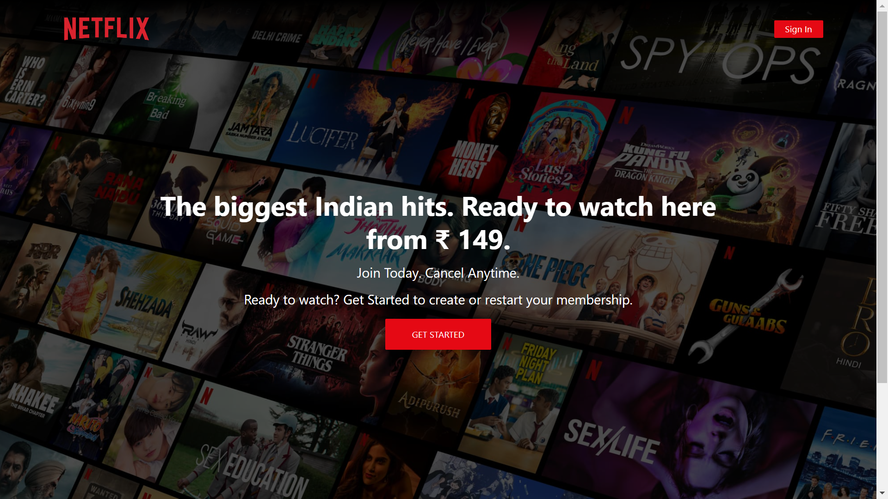
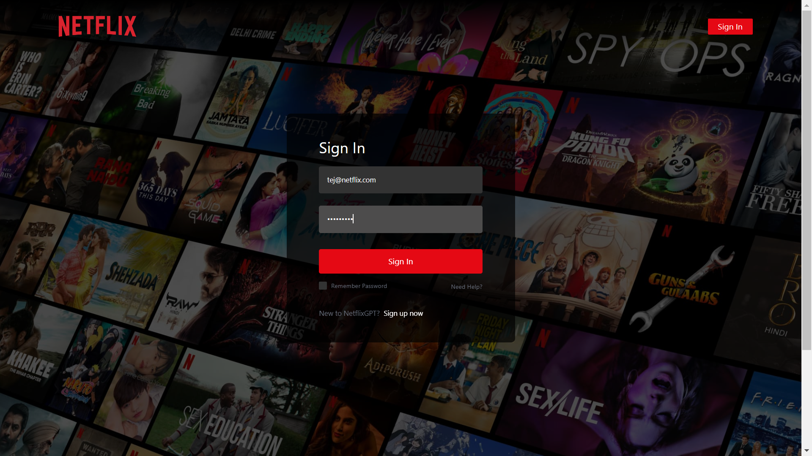
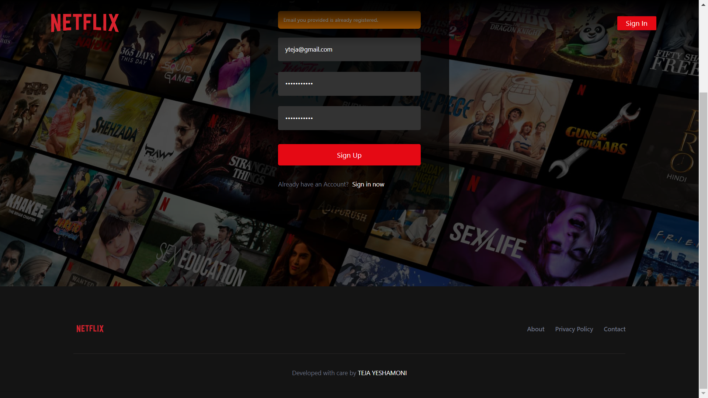
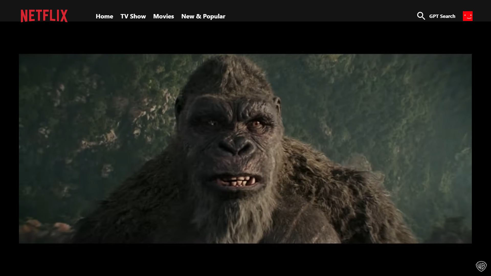
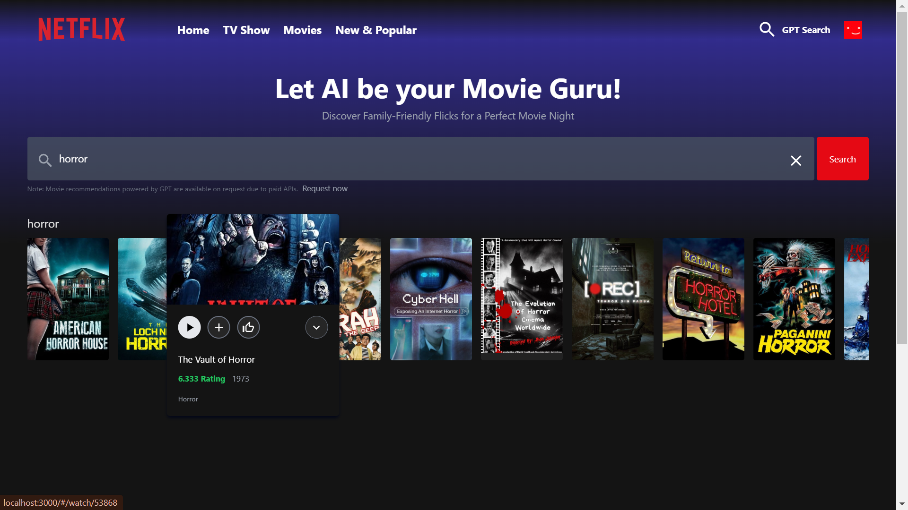
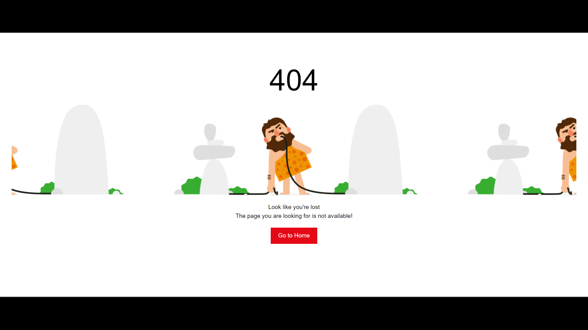

# NetflixGPT

Experience NetflixGPT: A Feature-Rich, Mobile-Friendly Netflix Clone with Cutting-Edge Tech Stack! 🚀

## Table of Contents
- [Introduction](#introduction)
- [Features](#features)
- [Screenshots](#screenshots)
- [Tech Stack](#tech-stack)
- [Getting Started](#getting-started)
- [Installation](#installation)
- [Usage](#usage)
- [Contributing](#contributing)
- [License](#license)

## Introduction
Dive into NetflixGPT, a meticulously crafted Netflix clone boasting a stellar tech stack, including React, Redux, Webpack, React Router, TMDB APIs, Tailwind CSS, Firebase, React-DOM, and Jest. This powerhouse combination delivers a web application designed for peak performance and effortless user interactions. NetflixGPT is fully optimized to ensure lightning-fast load times and an ultra-smooth user experience, making it perfect for both desktop and mobile devices. Enjoy a user-friendly interface that offers an immersive viewing experience, all in the palm of your hand.

Join me in exploring the future of web development, where innovation meets user-centric design to create NetflixGPT—a shining example of what's possible in the world of entertainment.

## Features
- **Responsive Design**: Seamlessly adapts to both desktop and mobile devices.
- **User Authentication**: Secure sign-up and login using Firebase.
- **Movie Browsing**: Browse and search for movies using the TMDB API.
- **Dynamic Routing**: Navigate through different sections effortlessly with React Router.
- **State Management**: Manage application state effectively with Redux.
- **Performance Optimization**: Fast load times with optimized Webpack configuration.
- **Testing**: Robust testing framework using Jest.
- **Styling**: Beautiful, modern UI with Tail

wind CSS.

## Screenshots
Here are some screenshots of NetflixGPT:

### Landing Page

## Sign In Page 

## Sign Up Page 

### Movie List Page

### Movie Watch Page

### GPT Search Page

### Not Found Page

## Tech Stack
- **Frontend**: React, Redux, React Router, React-DOM, Tailwind CSS
- **Backend**: Firebase (Authentication)
- **APIs**: TMDB (The Movie Database)
- **Build Tools**: Webpack
- **Testing**: Jest

## License
Distributed under the MIT License. See `LICENSE` for more information.
